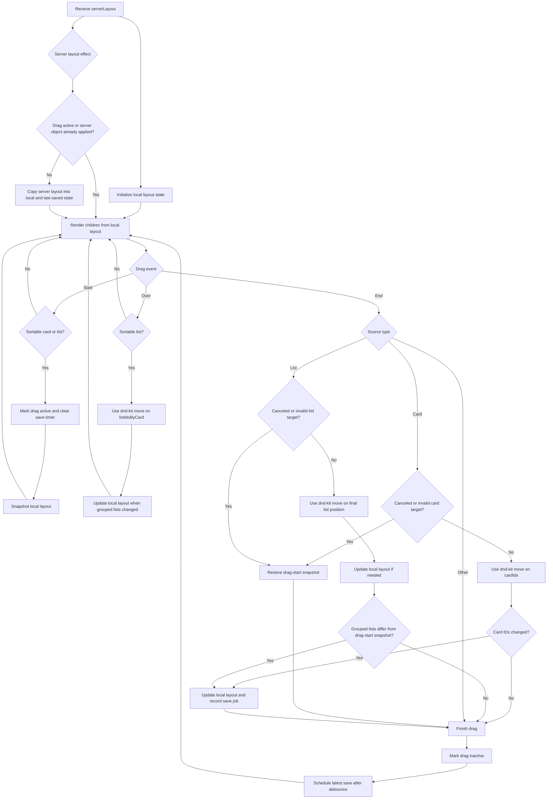
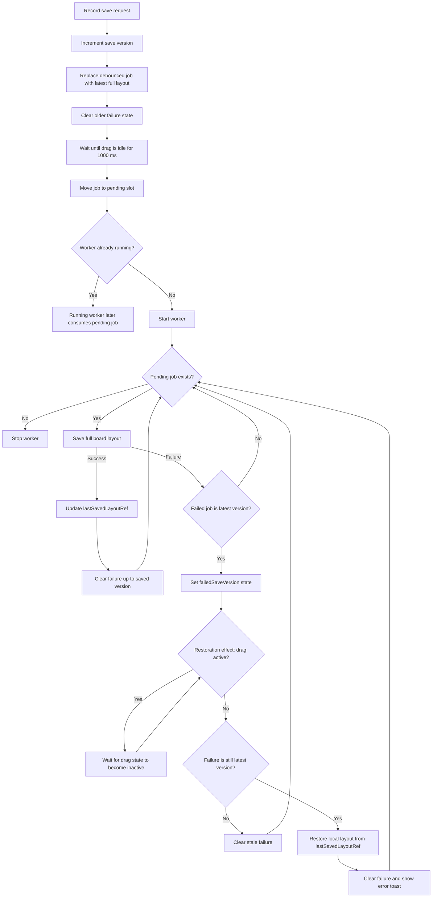

# BoardDragDropArea flow

## Save and restoration effects

The local `layout` state is the only layout rendered by the component. The refs have narrower responsibilities:

- `dragStartLayoutRef` restores canceled or invalid drag gestures.
- `lastSavedLayoutRef` restores the latest successfully saved layout after a request failure.
- `appliedServerLayoutRef` prevents an unchanged server snapshot from replacing optimistic local order when a drag ends.

The worker calls the `saveBoardLayout` Server Action, which validates the full layout and sends one atomic `save_board_layout` RPC request. An action error is handled by the same latest-version rollback flow shown above.
